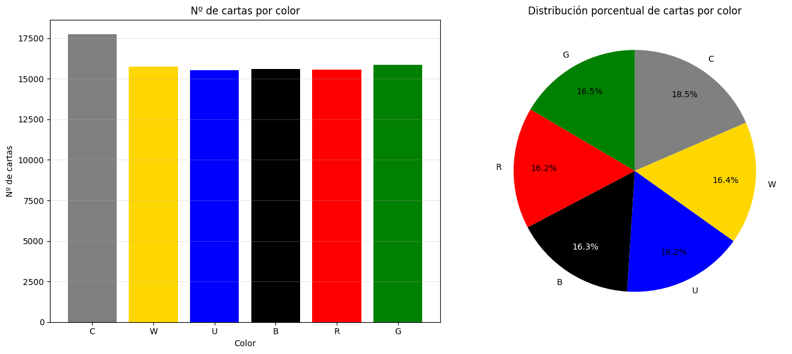
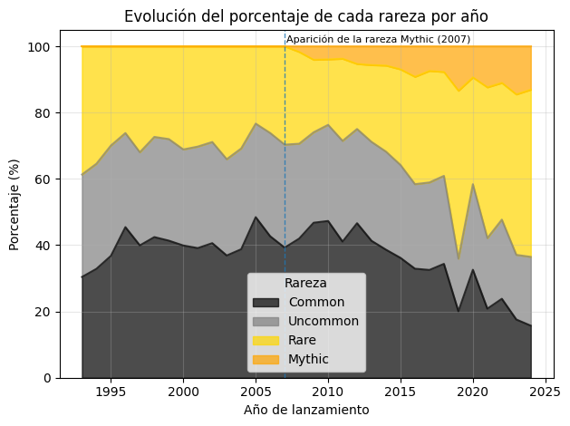

# Trading Card Dataset — Exploratory Data Analysis

Exploratory Data Analysis project built in Python to study patterns in a trading card dataset, including distributions, rarity trends, release patterns, and potential data-quality issues.

## Project goal
The objective of this project is to practice a complete EDA workflow:
- loading and inspecting the data,
- cleaning and validating relevant fields,
- exploring numerical and categorical patterns,
- generating visualizations,
- and extracting interpretable insights.

## Tech stack
- Python
- pandas
- numpy
- matplotlib
- Jupyter Notebook

## Repository contents
- `eda_mtg_ggg.ipynb` — main notebook with the full analysis
- `img/` — exported charts used in the README
- `README.md` — project overview and key findings

## Example questions explored
- How are key card attributes distributed?
- How do rarity and release variables relate to each other?
- Are there noticeable outliers or inconsistencies in the dataset?
- What patterns appear across time, categories, or card characteristics?

## Visual preview

  
  

## Key takeaways
This project demonstrates:
- structured exploratory analysis,
- data cleaning and inspection,
- clear visual communication,
- and interpretation of results beyond plotting.

## Possible next steps
- build simple predictive models,
- cluster cards by attributes,
- or create an interactive dashboard for exploration.

## Author
Guillermo Gil Garro
